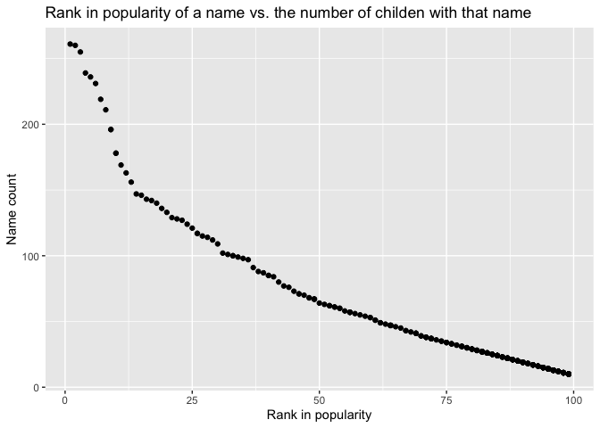

P8105\_hw2\_hx2306
================
HuijunXiao
10/1/2021

## Problem 1

-   Step 1: Read and clean the Mr. Trash Wheel sheet.

``` r
path_mtw <- 
  "./dataset/Trash-Wheel-Collection-Totals-7-2020-2.xlsx"
mr_trashwheel <- 
  read_xlsx(
    path = path_mtw,
    sheet = "Mr. Trash Wheel") %>%                      #specify the sheet in the Excel file
  select(Dumpster:`Homes Powered*`) %>%                 #omit non-data entries
  janitor::clean_names() %>%
  drop_na(dumpster) %>%                                  #omit rows that do not include dumpster-specific data
  mutate(
    sports_balls = round(sports_balls, digits = 0)       #round the number of sports balls to the nearest integer
    )
```

    ## New names:
    ## * `` -> ...15
    ## * `` -> ...16
    ## * `` -> ...17

-   Step 2: Read and clean precipitation data for 2018 and 2019.

``` r
# 2018 Precipitation
prec2018 <- 
  read_xlsx(
    path = path_mtw,
    sheet = "2018 Precipitation",                          
    skip = 1) %>%                       
  janitor::clean_names() %>%
  drop_na()                                              #omit rows without precipitation data

prec2018["year"] <- 2018                                 #add a variable for year

# 2019 Precipitation
prec2019 <- 
  read_xlsx(
    path = path_mtw,
    sheet = "2019 Precipitation",                          
    skip = 1) %>%                       
  janitor::clean_names() %>%
  drop_na()                                             #omit rows without precipitation data

prec2019["year"] <- 2019                                #add a variable for year
```

-   Step 3: Combine precipitation datasets and convert month to a
    character variable.

``` r
perc_df <-
  rbind(prec2018,prec2019) %>%                          #combine precipitation datasets 
  mutate(
    month = month.name[month]
    ) %>%                                               #convert month to a character variable
  relocate(year,month)
```

-   Step 4: Write a paragraph about these data.

**This dataset contains three different trash wheel reports, which
includes the time and amounts of various types of trash collected, and
monthly precipitation report every year.**  
**For the Mr.Trash Wheel sheet, there are 454 lines of observations
after omitting rows that do not include dumpster-specific data. For
yearly precipitation datasets, the total precipitation in 2018 is 70.33
inches. The median number of sports balls in a dumpster in 2019 was 9.**

## Problem 2

-   Step 1: Clean the data in pol-month.csv.

``` r
pol_month <- 
  read_csv("./dataset/pols-month.csv") %>%
  janitor::clean_names() %>%
  separate(mon,c("year","month","day")) %>%             #separate mon into integer year, month,day
  mutate(month = as.integer(month),
         year = as.integer(year),
         day = as.integer(day)) %>%
  mutate(month = month.name[month])                     #replace month number with month name 
```

    ## Rows: 822 Columns: 9

    ## ── Column specification ────────────────────────────────────────────────────────
    ## Delimiter: ","
    ## dbl  (8): prez_gop, gov_gop, sen_gop, rep_gop, prez_dem, gov_dem, sen_dem, r...
    ## date (1): mon

    ## 
    ## ℹ Use `spec()` to retrieve the full column specification for this data.
    ## ℹ Specify the column types or set `show_col_types = FALSE` to quiet this message.

``` r
pol_month["president"] <-
  ifelse(
    pol_month["prez_gop"] == "0", "dem","gop"           #president taking values gop and dem
    )     

pol_month <- 
  pol_month %>%
  select(-prez_dem,-prez_gop,-day)                     #remove prez_dem/gop and day 
```

-   Step 2: Clean the data in snp.csv using a similar process to the
    above.

``` r
snp <- 
  read_csv("./dataset/snp.csv") %>%
  janitor::clean_names() %>%
  separate(date,c("month","day","year")) %>%             #separate date into integer year, month,day
  mutate(month = as.integer(month),
         year = as.integer(year),
         day = as.integer(day),
         year = ifelse(
           year <= 21, year+2000,year+1900)) %>%         #change year format 
  mutate(month = month.name[month]) %>%                  #replace month number with month name 
  relocate("year","month","day","close") %>%             #year & month leading columns
  select(-day)                                           # remove day column 
```

    ## Rows: 787 Columns: 2

    ## ── Column specification ────────────────────────────────────────────────────────
    ## Delimiter: ","
    ## chr (1): date
    ## dbl (1): close

    ## 
    ## ℹ Use `spec()` to retrieve the full column specification for this data.
    ## ℹ Specify the column types or set `show_col_types = FALSE` to quiet this message.

-   Step 3: Tidy the unemployment data

``` r
unemp <- 
  read_csv("./dataset/unemployment.csv") %>%
  pivot_longer(
    Jan:Dec,
    names_to = "month",
    values_to = "unemployment"
  ) %>%
  rename( year = Year)
```

    ## Rows: 68 Columns: 13

    ## ── Column specification ────────────────────────────────────────────────────────
    ## Delimiter: ","
    ## dbl (13): Year, Jan, Feb, Mar, Apr, May, Jun, Jul, Aug, Sep, Oct, Nov, Dec

    ## 
    ## ℹ Use `spec()` to retrieve the full column specification for this data.
    ## ℹ Specify the column types or set `show_col_types = FALSE` to quiet this message.

-   Step 4: Merge snp into pols and merge unemployment into result

``` r
snp_pols <-        
  left_join(pol_month,snp,by = c("year","month"))               #merge snp into pols

unemp_sp <-
  left_join(snp_pols,unemp,by = c("year","month"))             #merge unemployment 
```

-   Step 5:Write a paragraph about these data

**After cleaning the dataset, POLS\_MONTH dataset contains 9 variables,
which are YEAR, MONTH, GOV\_GOP, SEN\_GOP, REP\_GOP, GOV\_DEM, SEN\_DEM,
REP\_DEM and PRESIDENT. There are 822 lines of observations. The
PRESIDENT variable is created based on PREZ\_DEM and PREZ\_GOP in the
orginal dataset. People will be able to tell the number of national
politicians who are democratic or republican at any given time. The
range of years is from 1947 to 2015.**

**After cleaning SNP dataset, it contains 3 variables, which are YEAR,
MONTH and CLOSE. YEAR and MONTH will tell the date of observation while
CLOSE will tell the closing values of the S&P stock index on the
associated date. There are 787 lines of observations. The range of years
is from 1950 to 2015.**

**After tidying UNEMPLOYMENT dataset, it contains 3 variables, which are
YEAR,MONTH,and UNEMPLOYMENT. Under UNEMPLOYMENT, people will be able to
tell the percentage of unemployment in corresponding month of the
associated year. There are 816lines of observations and the range of
years is from 1948 to 2015.**

## Problem 3

-   Step 1: Load and tidy the data

``` r
baby_name <- 
  read_csv("./dataset/Popular_Baby_Names.csv") %>%
  janitor::clean_names() %>%
  mutate(
    childs_first_name = str_to_sentence(childs_first_name),                
    ethnicity = str_to_sentence(ethnicity),
    gender = str_to_sentence(gender),
    ethnicity = recode(ethnicity, 
                       `Asian and paci` = "Asian and pacific islander",
                       `Black non hisp` = "Black non hispanic",
                       `White non hisp` = "White non hispanic")) %>%
  distinct()
```

    ## Rows: 19418 Columns: 6

    ## ── Column specification ────────────────────────────────────────────────────────
    ## Delimiter: ","
    ## chr (3): Gender, Ethnicity, Child's First Name
    ## dbl (3): Year of Birth, Count, Rank

    ## 
    ## ℹ Use `spec()` to retrieve the full column specification for this data.
    ## ℹ Specify the column types or set `show_col_types = FALSE` to quiet this message.

-   Step 2: Produce a table - Olivia

``` r
olivia_df <-
  baby_name %>%
  filter(gender == "Female" &
           childs_first_name == "Olivia") %>%
  select(-gender,-count,-childs_first_name) %>%
  pivot_wider(
    names_from = year_of_birth,
    values_from = rank) 

olivia_df <-
  olivia_df[,c("ethnicity","2011","2012","2013","2014","2015","2016")]

olivia_df  
```

    ## # A tibble: 4 × 7
    ##   ethnicity                  `2011` `2012` `2013` `2014` `2015` `2016`
    ##   <chr>                       <dbl>  <dbl>  <dbl>  <dbl>  <dbl>  <dbl>
    ## 1 Asian and pacific islander      4      3      3      1      1      1
    ## 2 Black non hispanic             10      8      6      8      4      8
    ## 3 Hispanic                       18     22     22     16     16     13
    ## 4 White non hispanic              2      4      1      1      1      1

-   Step 3: Produce a similar table showing the most popular name among
    male children over time

``` r
male_df <-
  baby_name %>%
  filter(gender == "Male" &
           rank == "1") %>%
  select(year_of_birth,ethnicity,childs_first_name) %>%
  pivot_wider(
    names_from = year_of_birth,
    values_from = childs_first_name)

male_df <-
  male_df[,c("ethnicity","2011","2012","2013","2014","2015","2016")]

male_df
```

    ## # A tibble: 4 × 7
    ##   ethnicity                  `2011`  `2012` `2013` `2014` `2015` `2016`
    ##   <chr>                      <chr>   <chr>  <chr>  <chr>  <chr>  <chr> 
    ## 1 Asian and pacific islander Ethan   Ryan   Jayden Jayden Jayden Ethan 
    ## 2 Black non hispanic         Jayden  Jayden Ethan  Ethan  Noah   Noah  
    ## 3 Hispanic                   Jayden  Jayden Jayden Liam   Liam   Liam  
    ## 4 White non hispanic         Michael Joseph David  Joseph David  Joseph

-   Step 4: Produce a scatter plot

``` r
scatter_df <-
  baby_name %>%
  filter(year_of_birth == "2016" &
           gender == "Male" &
           ethnicity == "White non hispanic") %>%
  select(-year_of_birth,-gender,-ethnicity)

ggplot(scatter_df,
         aes(x = rank, y=count)) +
  geom_point() +
  ggtitle("Rank in popularity of a name vs. the number of childen with that name") +
  xlab("Rank in popularity") +
  ylab("Name count")
```

<!-- -->
